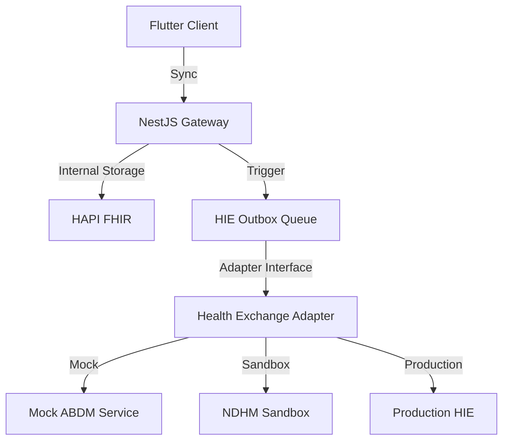

# INTEROPERABILITY ARCHITECTURE

## 1. Core Principles
The Setu platform acts as a secure clinical enclave. Internal clinical workflows (Flutter to NestJS to HAPI FHIR) operate continuously, whether external interoperability is available or not.

External Health Information Exchange (HIE/ABDM) is handled strictly through an **Adapter Layer**, completely decoupled from the core clinical state machines.

## 2. Component Diagram

## 3. The Adapter Pattern
All external communication must implement the `HealthExchangeAdapter` interface:
- `createExchangeRequest(patientId, purpose, scope)`
- `submitInformation(exchangeId, bundle)`
- `checkStatus(exchangeId)`
- `receiveInformation(exchangeId)`

This ensures the Setu backend never contains hardcoded `https://dev.abdm.gov.in` logic inside its clinical modules (like `CarePathwayService`).

## 4. Consent-Gated Flow
1. **Trigger**: A clinical event (e.g., Emergency Referral) requests data sharing.
2. **Consent Engine**: Checks active `Consent` resources for `purpose=REFERRAL`.
3. **Queue**: Data is minimized to the required scope and placed in `HIE Outbox`.
4. **Adapter**: The adapter transmits the bundle via external networks.
